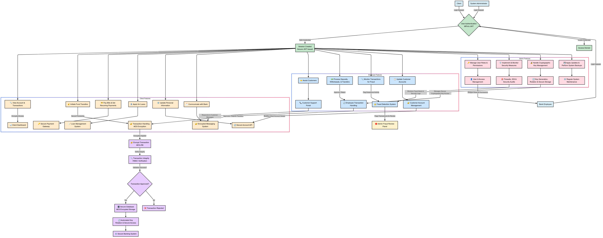

# 🔐 MyBank Secure Cryptosystem

An advanced Flask-based secure banking system with full-stack cryptographic enforcement.

## 📌 Key Features

- **AES Encryption** for data confidentiality  
- **RSA Key Exchange** & **Digital Signatures** for secure communication  
- **HMAC-SHA256** for transaction integrity  
- **Multi-Factor Authentication (MFA)** using OTP  
- **JWT Authentication** with Role-Based Access Control  
- **Secure Encrypted Messaging**  
- Admin, Employee, and Client Portals with custom dashboards

## 🧠 Architecture



## 🖥️ How to Run

```bash
# Create virtual environment (optional)
python -m venv venv
source venv/bin/activate  # or venv\Scripts\activate on Windows

# Install requirements
pip install -r requirements.txt

# Run the app
python app.py
